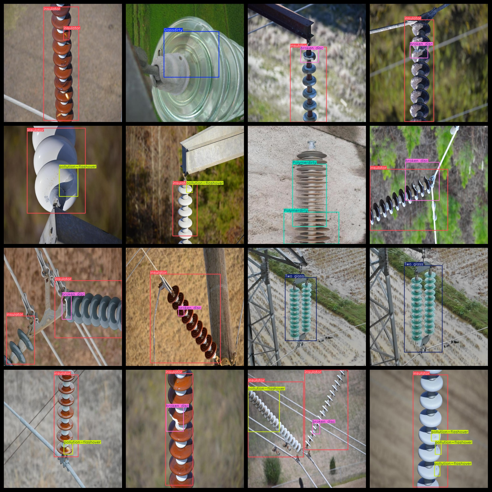
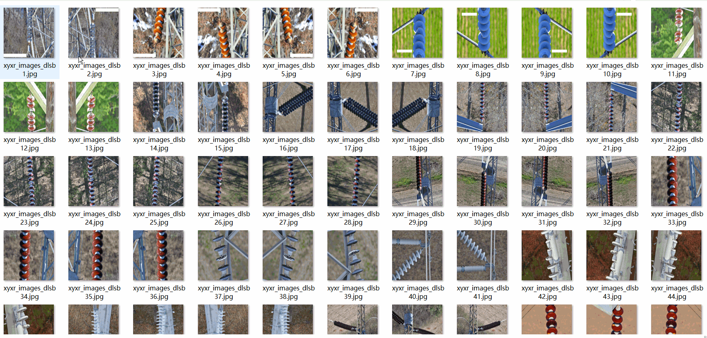

# Insulator Defect Detection Dataset 2148 imagesVOC+YOLO format

This dataset contains 2148 images of insulator defects. It is in VOC + YOLO format, which means it includes both the VOC dataset and the YOLO dataset. The images are labeled with the type of defect and its location on the insulator.

Dataset format: Pascal VOC format + YOLO format (the txt file does not contain the split path, it only contains jpg images and corresponding VOC format xml files and yolo format txt files)

Number of images (number of jpg files): 2148

Number of XML files: 2148

Number of txt files: 2148

Number of categories: 9

The Github repository is: datasets_sl

['Glassdirty', 'Glassloss', 'Polymer', 'Polymerdirty', 'Two glass', 'broken disc', 'insulator', 'pollution-flashover', 'snow']

Label Chinese Translation: Glass dirty, glass loss, polymer, polymer dirty, double glass, damaged disc, insulator, pollution flashover, snow

Number of boxes labeled in each category:

The number of GlassDirty frames is 289.

Glass Loss Frame Count = 135

The number of polymers is 96.

The number of polymer dirty frames is 220.

Two glass frames = 202

Broken disc frame count = 808

insulator frame count = 1583

Pollution-Flashover Boxes = 1471

Snowbox count = 9

Total Frames: 4813

Number of images per category:

Glassdirty has 185 images.

Glassloss's possession of the image count = 113

Polymer occupies 92 pictures.

Polymerdirty annotated images = 151

Two glasses have 196 pictures.

Broken disc has 627 image counts.

Insulator occupies 1442 pictures.

Pollution-flashover has 643 images.

Snow owns 6 pictures.

Image resolution: 640x640

Use the labeling tool: labelImg

Dataset Augmentation: Yes

Rules for annotation: Draw a rectangle around the category.

Important note: The dataset does not have been divided into training, validation, and testing sets.

Special Disclaimer: This dataset does not guarantee the accuracy of the trained models or weight files.

Annotation and image details are as follows:

## Images

---

Here is a pay link on Stripe (https://buy.stripe.com/3cs8yP7sY87d0vu9AB). Please contact me lonlonago@foxmail.com after funding $89, and I will send you a complete data files, thank you!

